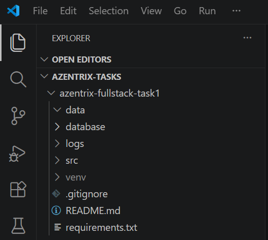
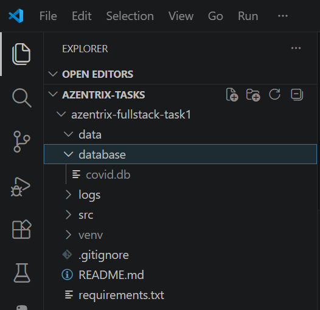
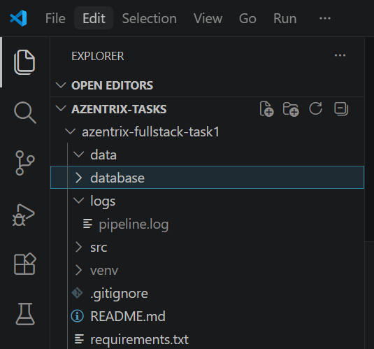

# Automated ETL Pipeline

## Overview

This project implements an automated ETL (Extract, Transform, Load) pipeline that extracts COVID-19 data from a public REST API, transforms and cleans the data, creates derived metrics, loads the processed data into a SQLite database, and logs execution details. The pipeline is scheduled to run automatically every 24 hours.

---

## Features

- Extracts COVID-19 data from a public REST API
- Handles missing/null values
- Normalizes country names to a consistent format
- Creates derived columns:
  - `active_cases`
  - `death_rate`
- Loads processed data into a SQLite database
- Logs pipeline execution status
- Runs automatically every 24 hours using APScheduler

---

## Technologies Used

- Python
- Pandas
- Requests
- SQLite
- APScheduler
- Logging

---

## ETL Workflow

```text
COVID API
    ↓
Extract
    ↓
Transform
    ↓
SQLite Database
    ↓
Logging
    ↓
Scheduler (24 Hours)
```

---

## Project Structure

```text
azentrix-fullstack-task1
│
├── data
│
├── database
│   └── covid.db
│
├── logs
│   └── pipeline.log
│
├── src
│   ├── extract.py
│   ├── transform.py
│   ├── load.py
│   ├── main.py
│   └── scheduler.py
│
├── requirements.txt
├── README.md
└── .gitignore
```

---

## Data Source

Public COVID-19 API:

```text
https://disease.sh/v3/covid-19/countries
```

---

## Transformations Performed

### 1. Null Handling

Missing values are replaced with default values using Pandas.

### 2. Data Normalization

Country names are converted to uppercase for consistency.

Example:

```text
India → INDIA
Japan → JAPAN
```

### 3. Derived Columns

#### Active Cases

```text
active_cases = cases - recovered - deaths
```

#### Death Rate

```text
death_rate = (deaths / cases) * 100
```

---

## Database

Processed data is loaded into a SQLite database:

```text
database/covid.db
```

Table Name:

```text
covid_data
```

---

## Logging

Pipeline execution details are stored in:

```text
logs/pipeline.log
```

Example Log Entry:

```text
2026-06-01 21:30:45 - STATUS=SUCCESS | ROWS=231
```

---

## Scheduling

The pipeline is scheduled using APScheduler.

```python
scheduler.add_job(
    run_pipeline,
    "interval",
    hours=24
)
```

---

## Installation

Clone the repository:

```bash
git clone <repository-url>
```

Move into the project folder:

```bash
cd azentrix-fullstack-task1
```

Create a virtual environment:

```bash
python -m venv venv
```

Activate virtual environment:

### Windows

```bash
venv\Scripts\activate
```

Install dependencies:

```bash
pip install -r requirements.txt
```

---

## Running the Pipeline

Execute ETL pipeline:

```bash
cd src
python main.py
```

Expected Output:

```text
SUCCESS: 231 rows loaded
```

---

## Running the Scheduler

```bash
cd src
python scheduler.py
```

The pipeline will automatically execute every 24 hours.

---

## Screenshots

Add the following screenshots before submission:

### Project Structure



### Successful ETL Execution


### SQLite Database



### Pipeline Logs



---

## Future Improvements

- Dockerize the ETL pipeline
- Add PostgreSQL support
- Deploy pipeline to cloud infrastructure
- Integrate Apache Airflow
- Add automated monitoring and alerts

---

## Author

Mukkapati Jhansi

Data Analytics | Artificial Intelligence | Python Developer